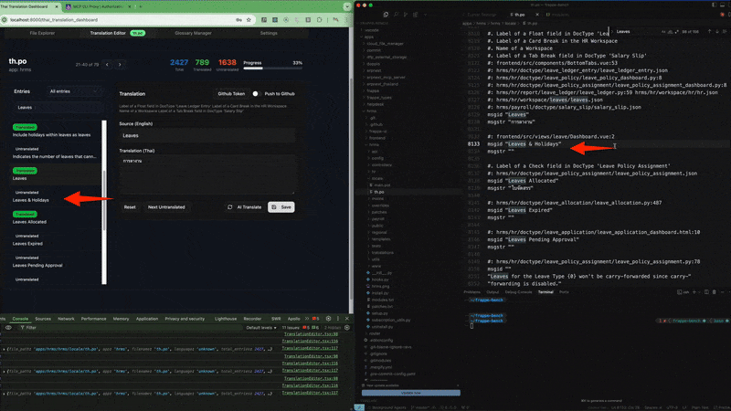

# Translation Tools for Frappe/ERPNext

An AI-powered translation utility for ERPNext that helps translate PO files using advanced language models like OpenAI GPT and Anthropic Claude, with a specialized Thai Tax Consultant Bot.

[](https://www.youtube.com/watch?v=cB1kZOpYsXQ)

[🇬🇧 English](#english-version) | [🇹🇭 ภาษาไทย](#thai-version--ภาษาไทย)

---

## English Version

## Translation Tools Overview

Translation Tools is a standalone app for ERPNext that provides powerful machine translation capabilities for localizing ERPNext to other languages. It features:

- OpenAI GPT and Anthropic Claude integration for high-quality translations
- Specialized handling of software localization with preservation of formatting tags
- Thai language glossary for consistent terminology
- Batch processing for efficiency and rate limit management
- User-friendly dashboard with GitHub synchronization capabilities

### Installation

#### Prerequisites

- ERPNext installation with bench
- Python 3.10 or newer
- An OpenAI API key or Anthropic API key
- Node.js and npm (for UI components)
- [MCP Server](https://github.com/modelcontextprotocol/python-sdk)

#### Installing the App

```bash
# Navigate to your bench directory
cd frappe-bench

# Get the app from GitHub
bench get-app https://github.com/ManotLuijiu/translation_tools.git

# Install the app on your site
bench --site your-site.local install-app translation_tools
```

### Updating Desktop Icon After Installation

The app's desktop icon configuration in `hooks.py` is read **only once** during installation. If you later update `add_to_apps_screen` settings (logo, title, route), the desktop icon won't automatically reflect those changes.

#### Using the Sync Command

```bash
# Check what would change (dry-run mode)
bench --site your-site.local sync-app-desktop-icon --app translation_tools --check

# Apply changes to match hooks.py
bench --site your-site.local sync-app-desktop-icon --app translation_tools

# Force delete and recreate from hooks.py
bench --site your-site.local sync-app-desktop-icon --app translation_tools --force
```

The command compares:
- `logo` from `add_to_apps_screen` → `logo_url` in DB
- `title` from `add_to_apps_screen` → `label` in DB
- `route` from `add_to_apps_screen` → `link` in DB

#### Manual Update (Alternative)

If the command is unavailable, update directly:

```bash
# Update logo
bench --site your-site.local execute \
  "frappe.db.set_value('Desktop Icon', 'Translation Tools', 'logo_url', '/assets/translation_tools/images/icons/icon.svg')"

# Update route
bench --site your-site.local execute \
  "frappe.db.set_value('Desktop Icon', 'Translation Tools', 'link', '/desk/translation-tools')"

# Clear cache to see changes
bench --site your-site.local clear-cache
```

### ⚠️ Important: `name` and `title` Must Match Workspace Name

The `name` and `title` in `add_to_apps_screen` **must match** the `name` field in Workspace Sidebar. This is because Frappe uses `title.lower()` as the lookup key.

**Correct `add_to_apps_screen` config in `hooks.py`:**
```python
add_to_apps_screen = [
    {
        "name": "translation_tools",                              # Must match Workspace name
        "logo": "/assets/translation_tools/images/icons/translation-svgrepo-com.svg",
        "title": "Translation Tools",                             # Must match Workspace name
        "route": "/desk/translation-tools",
        # "has_permission": "inpac_pharma.api.permission.has_app_permission"
    }
]
```

### ⚠️ Dead Code: `modules` Dict is NOT a Valid Hook

You may see a `modules` dict in `hooks.py` from boilerplate templates:

```python
# ❌ DO NOT USE - This is dead code, NOT a valid Frappe hook
modules = {
    "Translation Tools": {
        "color": "blue",
        "icon": "/assets/translation_tools/images/translation_icon.svg",
        "type": "module",
        "label": "Translation Tools",
    }
}
```

**Why it's dead:**
- Frappe does NOT call `get_hooks("modules")`
- `bootinfo.modules` is NOT populated from this
- No JS code reads `frappe.boot.modules`

**What to use instead:**
| Instead of | Use |
|------------|-----|
| `modules[].color` | `app_color` or `desk_page[].color` |
| `modules[].icon` | `app_icon` or `desk_page[].icon` |
| `modules[].label` | `add_to_apps_screen[].title` |

**Action:** Remove the `modules` dict from your `hooks.py` - it's unused and causes confusion.

### ⚠️ Dead Code: `config/desktop.py` and `desktop/config.py`

Both files are **boilerplate orphans** - NOT used by Frappe v15+:

```
translation_tools/config/desktop.py      # Created Jan 24 - NEVER used
translation_tools/desktop/config.py     # Created May 5 - NEVER used
```

**Why they're dead:**
- Frappe does NOT call these files
- No `get_hooks()` references them
- No JS/Python code imports them
- Never modified since creation (git shows no history)

**What they were for (v14):**
| File | Was Used For |
|------|-------------|
| `config/desktop.py` | Old module listing system |
| `desktop/config.py` | Old app listing system |

**What to use instead:**
| Instead of | Use |
|------------|-----|
| `config/desktop.py` | `add_to_apps_screen` in hooks.py |
| `desktop/config.py` | `desk_page` in hooks.py |

**Action:** Delete these files to reduce confusion:

```bash
rm translation_tools/config/desktop.py
rm translation_tools/desktop/config.py
rm -rf translation_tools/desktop/  # if empty
```

### ⚠️ Critical: `name` and `title` must both equal the Workspace name

- `"name": "Translation Tools"` → matches `Workspace.name`
- `"title": "Translation Tools"` → used for lookup key `"translation tools"`

**Example of broken config (icon will be hidden):**
```
add_to_apps_screen.title = "ASEAN Translation Tools"  → lookup key: "asean translation tools"
Workspace.name = "Translation Tools"                  → stored under: "translation tools"
                                                               ↓
                                                      KeyError → icon hidden!
```

**Fix if broken:**
```sql
-- Update Desktop Icon label to match Workspace name
UPDATE `tabDesktop Icon` SET label = 'Translation Tools' WHERE name = 'Translation Tools';

-- Update Workspace Sidebar title if different
UPDATE `tabWorkspace Sidebar` SET title = 'Translation Tools' WHERE name = 'Translation Tools';
```

### Using the Dashboard

After installation, you can access the Translation Dashboard from the ERPNext desktop:

1. Navigate to the "Translation Dashboard" icon in your ERPNext home screen
2. The dashboard has four main tabs:
   - **File Explorer**: Browse and select PO files for translation
   - **Translation Editor**: Edit translations manually or using AI
   - **Glossary Manager**: Manage terminology for consistent translations
   - **Settings**: Configure API keys and preferences

#### GitHub Synchronization

The dashboard includes GitHub synchronization features:

1. Click "Sync from GitHub" to open the GitHub sync dialog
2. Enter your GitHub repository URL and branch
3. Click "Find Translation Files" to discover PO files
4. Select files to sync and click "Preview Changes"
5. Review the changes and click "Apply Changes" to update your local translations

#### Manual vs AI Translation

You can toggle between manual and AI translation modes:

- **Manual Mode**: Translate entries yourself
- **AI Mode**: Let AI suggest translations based on your selected service

### Manual Translation Rebuild

Translation extraction no longer runs automatically on every `bench migrate` (it was causing 30+ minute migrate times). Run it manually when you add new UI strings or before a release:

```bash
# Full rebuild — all apps, all ASEAN locales (th/vi/lo/km/my)
bench --site <site> execute \
  translation_tools.utils.migration_translations.run_translation_commands_after_migrate

# Specific app/locale:
bench --site <site> update-app-translations --app {app_name} --locale th
bench --site <site> update-app-translations --app {app_name} --locale th

# List apps with translation support:
bench --site <site> list-translatable-apps
```

**When to run**: after adding new Python/JS/JSX strings, after pulling new code with new UI text, or before a production release.

---

## SPA Translation Workflow (React/TypeScript)

Since Frappe's standard translation system only extracts from Python files, translation_tools provides SPA support for React/TypeScript (.tsx/.jsx) files.


### Understanding the Translation Files

| File Type | Purpose | Location |
|-----------|---------|----------|
| `.csv` | Source strings extracted from SPA | `apps/{app}/{app}/translations/` |
| `.pot` | POT template (Python only) | `apps/{app}/{app}/locale/` |
| `.po` | Merged translations | `apps/{app}/{app}/locale/` |
| `.mo` | Compiled runtime | `sites/assets/locale/{locale}/LC_MESSAGES/` |

### The Gap: Frappe Standard vs SPA

Frappe's `migrate-csv-to-po` only copies strings that exist in `.pot` file. Since Frappe's extractor (Babel) only scans Python files, SPA strings in `.csv` are **skipped**.

```
th.csv has:    "Apply" → "ใช้"
main.pot has:  ❌ "Apply" not found (SPA string)
Result:        ❌ SKIPPED by standard migrate-csv-to-po
```


### Solution: Custom Bench Commands

translation_tools provides custom commands to bridge this gap:

| Command | Purpose |
|---------|---------|
| `bench gen-po` | Full workflow: CSV + POT + PO + MO |
| `bench migrate-csv-to-po-spa` | CSV → PO (SPA-aware, includes ALL CSV entries) |
| `bench compile-mo-files` | PO → MO only |


### Usage

#### Full workflow (recommended after code changes)

```bash
# Extract SPA strings to CSV, then CSV → PO → MO for all custom apps
bench gen-po --site <site_name>

# Specific app
bench gen-po --site <site_name> --app {app_name}
```

#### CSV already exists (Thai team already translated)

```bash
# Skip CSV extraction (use existing CSV from GitHub), only PO → MO
bench gen-po --site <site_name> --app {app_name} --skip-csv
```

#### Manual commands (if needed)

```bash
# Step 1: Extract SPA strings to CSV (overwrites existing CSV)
bench gen-po --app {app_name}

# Step 2: CSV → PO (SPA-aware, includes all CSV entries)
bench migrate-csv-to-po-spa --app {app_name} --locale th

# Step 3: Compile PO → MO for runtime
bench compile-mo-files --app {app_name} --locale th
```

### How CSV Extraction Works

The SPA extractor scans `.tsx/.jsx/.ts` files for patterns:

```tsx
// Pattern 1: JSX text content
<Label>Apply</Label>

// Pattern 2: Props
<FormInput label="Personal Expenses" />

// Pattern 3: Translation wrapper
{__("Total Monthly Obligations")}
```

Extracts to `translations/th.csv`:

```csv
"Apply","ใช้",""
"Personal Expenses","ค่าใช้จ่ายส่วนตัว",""
"Total Monthly Obligations","ยอดรวมค่าใช้จ่ายรายเดือน",""
```

### Best Practices

1. **Commit CSV to GitHub** - CSV is versioned, so Thai team can edit and commit translations
2. **GitHub backup** - If CSV gets overwritten, simply `git checkout` to restore
3. **Git diff** - See exactly what strings changed/added after `gen-po`
4. **Run before release** - Always run `gen-po` before production deployment to capture new strings

### Troubleshooting

#### Command not found: migrate-csv-to-po-spa

```bash
# Clear bench cache and retry
bench clear-cache
bench migrate-csv-to-po-spa --help
```

#### CSV strings not in PO

Ensure you're using `migrate-csv-to-po-spa` (not the standard `migrate-csv-to-po`).

```bash
# Check if string exists in CSV
grep "Apply" apps/{app_name}/{app_name}/translations/th.csv

# Check if string exists in PO (should be there after migrate-csv-to-po-spa)
grep "Apply" apps/{app_name}/{app_name}/locale/th.po
```

---


### Command Line Usage

#### Basic Usage

To translate a PO file to Thai:

```bash
./bin/translate-po apps/frappe/frappe/locale/th.po
```

#### Advanced Options

```bash
# Specify a different target language
./bin/translate-po --target-lang=ja apps/erpnext/erpnext/locale/ja.po

# Use Anthropic Claude instead of OpenAI
./bin/translate-po --model-provider=claude apps/frappe/frappe/locale/th.po

# Use a specific OpenAI model
./bin/translate-po --model=gpt-4-1106-preview apps/erpnext/erpnext/locale/th.po

# Adjust batch size for processing
./bin/translate-po --batch-size=20 apps/frappe/frappe/locale/th.po

# Save output to a specific file
./bin/translate-po --output=my-translations.po apps/frappe/frappe/locale/th.po

# Do a dry run without making API calls
./bin/translate-po --dry-run apps/frappe/frappe/locale/th.po
```

### Customizing the Thai Glossary

The app includes a Thai glossary with common business and ERPNext terms. To customize it:

1. Edit the file at `translation_tools/translation_tools/utils/thai_glossary.py`
2. Add your own terminology to the `GLOSSARY` dictionary
3. Re-run the translator to use your updated terms

Example glossary entry:

```python
GLOSSARY = {
    "Invoice": "ใบแจ้งหนี้",
    "Customer": "ลูกค้า",
    # Add your terms here
}
```

### Troubleshooting for AI Translate

#### API Rate Limits

If you encounter rate limit errors, try:

- Reducing the batch size (`--batch-size=5`)
- Adding more sleep time between batches (edit the `SLEEP_TIME` constant)
- Using a different model or provider

#### Response Format Issues

Different models return responses in different formats. If you encounter parsing issues:

- Use a newer model that supports JSON responses (gpt-4-1106-preview)
- Try the Claude model provider which may handle certain types of responses better

#### GitHub Sync Issues

If you encounter issues with GitHub synchronization:

1. Ensure your GitHub token is valid and has appropriate permissions
2. Verify the repository URL is correct and includes the organization/username
3. Check that the PO files in the repository follow the standard format

## Thai Tax Consultant Bot

A sophisticated AI-powered Thai Tax Consultant Bot for ERPNext, built using the Model Context Protocol (MCP) to provide tax guidance, document analysis, and accounting assistance.

### Bot Overview

The Thai Tax Consultant Bot integrates with ERPNext to provide:

1. **Thai Tax Law Guidance** - Information about Thai tax regulations, rates, and compliance requirements
2. **Document Analysis** - Analysis of invoices, customer data, and financial statements
3. **Tax Calculations** - Personal and corporate income tax calculations based on Thai tax laws
4. **Financial Insights** - Insights into your company's financial position and inventory status

### Features

- **Natural Language Interface** - Chat naturally with the bot in Thai or English
- **Document Integration** - Query and analyze your ERPNext documents directly through chat
- **Command System** - Special commands for common operations (like `/tax`, `/invoice`, `/calculate`)
- **Tax Law Database** - Access to Thai tax regulations, updated periodically
- **Secure Implementation** - Respects ERPNext permissions system

#### Setup Steps

1. **Install the Translation Tools app** (see installation instructions above)

2. **Configure MCP Server in site_config.json:**

   ```json
   {
     "mcp_server_url": "http://localhost:8000",
     "mcp_api_key": "your-api-key",
     "anthropic_api_key": "your-claude-api-key"
   }
   ```

3. **Configure the Tax Bot Settings in the ERPNext interface:**

   ```bash
   Translation Tools > Tax Bot Settings
   ```

4. **Set up the Thai Tax Law DocType** using the provided import template

5. **Restart your ERPNext server:**

   ```bash
   bench restart
   ```

### Usage

#### Starting a Chat

1. Click on the Thai Tax Bot icon in the navigation bar (star icon)
2. Start typing your questions about Thai taxes or accounting

#### Available Commands

- `/tax [query]` - Search Thai tax laws
- `/invoice [invoice_id]` - Analyze a sales invoice
- `/customer [customer_id]` - Analyze a customer's data
- `/inventory` - Analyze current inventory status
- `/finance` - Show financial dashboard
- `/calculate [income_type] [amount]` - Calculate tax
- `/clear` - Clear conversation context
- `/help` - Show help message

#### Example Queries

- "What is the VAT rate in Thailand?"
- "How do I calculate withholding tax for a foreign contractor?"
- "What are the current personal income tax brackets in Thailand?"
- "Analyze invoice INV-00123"
- "What's the tax treatment for software development costs?"

### Technical Architecture

The Thai Tax Consultant Bot consists of:

1. **Chat Interface** - Frontend implementation using Frappe's chat framework
2. **MCP Client** - JavaScript client for the Model Context Protocol
3. **MCP Server API** - Python backend API that interfaces with the MCP Server
4. **Thai Tax Law DocType** - Custom DocType for storing tax law information
5. **Tax Bot Settings** - Configuration DocType for customizing the bot

### Customization

See the full documentation for details on customizing:

- Bot styling
- Adding new tools
- Modifying the system prompt
- Implementing new commands

### Troubleshooting for MCP

Check the server logs for error messages with these prefixes:

- `MCP API Error`
- `MCP Tool Call Error`
- `MCP Resource Error`
- `MCP Prompt Error`
- `Claude API Error`
- `Tool Execution Error`

## Support the Project

If you find this tool useful for your ERPNext localization efforts, you can support further development:

- **Buy me a coffee**: [https://ko-fi.com/manotluijiu](https://ko-fi.com/manotluijiu)
- **GitHub Sponsor**: [https://github.com/sponsors/ManotLuijiu](https://github.com/sponsors/ManotLuijiu)

Your support helps maintain and improve this open-source project. Thank you!

## License

This project is licensed under the MIT License - see the LICENSE file for details.

## Contributing

Contributions are welcome! Please feel free to submit a Pull Request.

---

## Thai Version / ภาษาไทย

## ภาพรวม

Translation Tools เป็นแอปสแตนด์อโลนสำหรับ ERPNext ที่มอบความสามารถในการแปลภาษาด้วยเครื่องที่ทรงพลังสำหรับการแปล ERPNext เป็นภาษาอื่นๆ โดยมีคุณสมบัติดังนี้:

- การผสานรวม OpenAI GPT และ Anthropic Claude สำหรับการแปลคุณภาพสูง
- การจัดการเฉพาะทางสำหรับการแปลซอฟต์แวร์และการรักษาแท็กการจัดรูปแบบ
- อภิธานศัพท์ภาษาไทยสำหรับคำศัพท์ที่สอดคล้องกัน
- การประมวลผลเป็นชุดเพื่อประสิทธิภาพและการจัดการขีดจำกัดอัตรา
- แดชบอร์ดที่ใช้งานง่ายพร้อมความสามารถในการซิงค์กับ GitHub

### การติดตั้ง

#### ข้อกำหนดเบื้องต้น

- การติดตั้ง ERPNext ด้วย bench
- Python 3.10 หรือใหม่กว่า
- OpenAI API key หรือ Anthropic API key

#### การติดตั้งแอป

```bash
# นำทางไปยังไดเรกทอรี bench ของคุณ
cd frappe-bench

# รับแอปจาก GitHub
bench get-app https://github.com/ManotLuijiu/translation_tools.git

# ติดตั้งแอปบนไซต์ของคุณ
bench --site your-site.local install-app translation_tools
```

### การอัปเดตไอคอนเดสก์ท็อปหลังการติดตั้ง

การตั้งค่าไอคอนเดสก์ท็อปใน `hooks.py` จะถูกอ่าน **เพียงครั้งเดียว** ระหว่างการติดตั้ง หากคุณอัปเดตการตั้งค่า `add_to_apps_screen` (โลโก้, ชื่อ, เส้นทาง) ในภายหลัง ไอคอนเดสก์ท็อปจะไม่อัปเดตโดยอัตโนมัติ

#### ใช้คำสั่ง Sync

```bash
# ตรวจสอบว่าจะเปลี่ยนแปลงอะไร (โหมด dry-run)
bench --site your-site.local sync-app-desktop-icon --app translation_tools --check

# อัปเดตให้ตรงกับ hooks.py
bench --site your-site.local sync-app-desktop-icon --app translation_tools

# บังคับลบและสร้างใหม่จาก hooks.py
bench --site your-site.local sync-app-desktop-icon --app translation_tools --force
```

คำสั่งจะเปรียบเทียบ:
- `logo` จาก `add_to_apps_screen` → `logo_url` ในฐานข้อมูล
- `title` จาก `add_to_apps_screen` → `label` ในฐานข้อมูล
- `route` จาก `add_to_apps_screen` → `link` ในฐานข้อมูล

#### การอัปเดตด้วยตนเอง (ทางเลือก)

```bash
# อัปเดตโลโก้
bench --site your-site.local execute \
  "frappe.db.set_value('Desktop Icon', 'Translation Tools', 'logo_url', '/assets/translation_tools/images/icons/icon.svg')"

# อัปเดตเส้นทาง
bench --site your-site.local execute \
  "frappe.db.set_value('Desktop Icon', 'Translation Tools', 'link', '/desk/translation-tools')"

# ล้างแคชเพื่อดูการเปลี่ยนแปลง
bench --site your-site.local clear-cache
```

### การใช้แดชบอร์ด

หลังจากการติดตั้ง คุณสามารถเข้าถึงแดชบอร์ดการแปลจากเดสก์ท็อป ERPNext:

1. นำทางไปยังไอคอน "Translation Dashboard" ในหน้าจอหลัก ERPNext
2. แดชบอร์ดมีแท็บหลักสี่แท็บ:
   - **File Explorer**: เรียกดูและเลือกไฟล์ PO สำหรับการแปล
   - **Translation Editor**: แก้ไขการแปลด้วยตนเองหรือใช้ AI
   - **Glossary Manager**: จัดการคำศัพท์สำหรับการแปลที่สอดคล้องกัน
   - **Settings**: กำหนดค่า API keys และการตั้งค่า

#### การซิงค์กับ GitHub

แดชบอร์ดรวมคุณสมบัติการซิงค์กับ GitHub:

1. คลิก "Sync from GitHub" เพื่อเปิดกล่องโต้ตอบการซิงค์ GitHub
2. ป้อน URL ของที่เก็บ GitHub และสาขา
3. คลิก "Find Translation Files" เพื่อค้นหาไฟล์ PO
4. เลือกไฟล์ที่จะซิงค์และคลิก "Preview Changes"
5. ตรวจสอบการเปลี่ยนแปลงและคลิก "Apply Changes" เพื่ออัปเดตการแปลในเครื่องของคุณ

#### การแปลแบบธรรมดาและแบบ AI

คุณสามารถสลับระหว่างโหมดการแปลแบบธรรมดาและแบบ AI:

- **Manual Mode**: แปลรายการด้วยตัวเอง
- **AI Mode**: ให้ AI แนะนำการแปลตามบริการที่คุณเลือก

### การใช้งานบรรทัดคำสั่ง

#### การใช้งานพื้นฐาน

ในการแปลไฟล์ PO เป็นภาษาไทย:

```bash
./bin/translate-po apps/frappe/frappe/locale/th.po
```

#### ตัวเลือกขั้นสูง

```bash
# ระบุภาษาเป้าหมายที่แตกต่าง
./bin/translate-po --target-lang=ja apps/erpnext/erpnext/locale/ja.po

# ใช้ Anthropic Claude แทน OpenAI
./bin/translate-po --model-provider=claude apps/frappe/frappe/locale/th.po

# ใช้โมเดล OpenAI เฉพาะ
./bin/translate-po --model=gpt-4-1106-preview apps/erpnext/erpnext/locale/th.po

# ปรับขนาดชุดสำหรับการประมวลผล
./bin/translate-po --batch-size=20 apps/frappe/frappe/locale/th.po

# บันทึกผลลัพธ์ไปยังไฟล์เฉพาะ
./bin/translate-po --output=my-translations.po apps/frappe/frappe/locale/th.po

# ทำการทดสอบโดยไม่ต้องเรียกใช้ API
./bin/translate-po --dry-run apps/frappe/frappe/locale/th.po
```

### การปรับแต่งอภิธานศัพท์ภาษาไทย

แอปนี้รวมอภิธานศัพท์ภาษาไทยที่มีคำธุรกิจและคำศัพท์ ERPNext ทั่วไป ในการปรับแต่ง:

1. แก้ไขไฟล์ที่ `translation_tools/translation_tools/utils/thai_glossary.py`
2. เพิ่มคำศัพท์ของคุณเองลงในพจนานุกรม `GLOSSARY`
3. รันเครื่องมือแปลอีกครั้งเพื่อใช้คำศัพท์ที่อัปเดตของคุณ

ตัวอย่างรายการอภิธานศัพท์:

```python
GLOSSARY = {
    "Invoice": "ใบแจ้งหนี้",
    "Customer": "ลูกค้า",
    # เพิ่มคำศัพท์ของคุณที่นี่
}
```

### การแก้ไขปัญหา (แปลภาษา)

#### ขีดจำกัดอัตรา API

หากคุณพบข้อผิดพลาดเกี่ยวกับขีดจำกัดอัตรา ให้ลอง:

- ลดขนาดชุด (`--batch-size=5`)
- เพิ่มเวลาหยุดระหว่างชุด (แก้ไขค่าคงที่ `SLEEP_TIME`)
- ใช้โมเดลหรือผู้ให้บริการที่แตกต่าง

#### ปัญหารูปแบบการตอบสนอง

โมเดลที่แตกต่างกันจะส่งคืนการตอบสนองในรูปแบบที่แตกต่างกัน หากคุณพบปัญหาการแยกวิเคราะห์:

- ใช้โมเดลที่ใหม่กว่าที่รองรับการตอบสนอง JSON (gpt-4-1106-preview)
- ลองผู้ให้บริการโมเดล Claude ซึ่งอาจจัดการกับการตอบสนองบางประเภทได้ดีกว่า

#### ปัญหาการซิงค์ GitHub

หากคุณพบปัญหาเกี่ยวกับการซิงค์ GitHub:

1. ตรวจสอบว่าโทเค็น GitHub ของคุณถูกต้องและมีสิทธิ์ที่เหมาะสม
2. ตรวจสอบว่า URL ของที่เก็บถูกต้องและรวมถึงองค์กร/ชื่อผู้ใช้
3. ตรวจสอบว่าไฟล์ PO ในที่เก็บเป็นไปตามรูปแบบมาตรฐาน

### บอทที่ปรึกษาภาษีไทย

บอทที่ปรึกษาภาษีไทยที่ขับเคลื่อนด้วย AI สำหรับ ERPNext ซึ่งสร้างขึ้นโดยใช้ MCP (Model Context Protocol) เพื่อให้คำแนะนำด้านภาษี การวิเคราะห์เอกสาร และความช่วยเหลือด้านบัญชี

#### คุณสมบัติหลัก

บอทที่ปรึกษาภาษีไทยผสานรวมกับ ERPNext เพื่อให้บริการ:

1. **คำแนะนำด้านกฎหมายภาษีไทย** - ข้อมูลเกี่ยวกับกฎระเบียบภาษีไทย อัตราภาษี และข้อกำหนดการปฏิบัติตามกฎระเบียบ
2. **การวิเคราะห์เอกสาร** - การวิเคราะห์ใบแจ้งหนี้ ข้อมูลลูกค้า และงบการเงิน
3. **การคำนวณภาษี** - การคำนวณภาษีเงินได้บุคคลธรรมดาและนิติบุคคลตามกฎหมายภาษีไทย
4. **ข้อมูลเชิงลึกทางการเงิน** - ข้อมูลเชิงลึกเกี่ยวกับสถานะทางการเงินและสินค้าคงคลังของบริษัทคุณ

#### การใช้งาน

เริ่มการสนทนาโดยคลิกที่ไอคอนบอทที่ปรึกษาภาษีไทยในแถบนำทาง และเริ่มพิมพ์คำถามของคุณเกี่ยวกับภาษีไทยหรือการบัญชี

##### คำสั่งที่ใช้ได้

- `/tax [คำค้นหา]` - ค้นหากฎหมายภาษีไทย
- `/invoice [รหัสใบแจ้งหนี้]` - วิเคราะห์ใบแจ้งหนี้การขาย
- `/customer [รหัสลูกค้า]` - วิเคราะห์ข้อมูลลูกค้า
- `/inventory` - วิเคราะห์สถานะสินค้าคงคลังปัจจุบัน
- `/finance` - แสดงแดชบอร์ดการเงิน
- `/calculate [ประเภทรายได้] [จำนวนเงิน]` - คำนวณภาษี
- `/clear` - ล้างบริบทการสนทนา
- `/help` - แสดงข้อความช่วยเหลือ

## สนับสนุนโครงการ

หากคุณพบว่าเครื่องมือนี้มีประโยชน์สำหรับการแปลภาษา ERPNext ของคุณ คุณสามารถสนับสนุนการพัฒนาต่อไปได้:

- **เลี้ยงกาแฟ**: [https://ko-fi.com/manotluijiu](https://ko-fi.com/manotluijiu)
- **สนับสนุนผ่าน GitHub**: [https://github.com/sponsors/ManotLuijiu](https://github.com/sponsors/ManotLuijiu)

การสนับสนุนของคุณช่วยในการบำรุงรักษาและปรับปรุงโครงการโอเพนซอร์สนี้ ขอบคุณครับ!

## ใบอนุญาต

โครงการนี้ได้รับอนุญาตภายใต้ MIT License - ดูไฟล์ LICENSE สำหรับรายละเอียด

## การมีส่วนร่วม

ยินดีต้อนรับการมีส่วนร่วม! โปรดส่ง Pull Request
